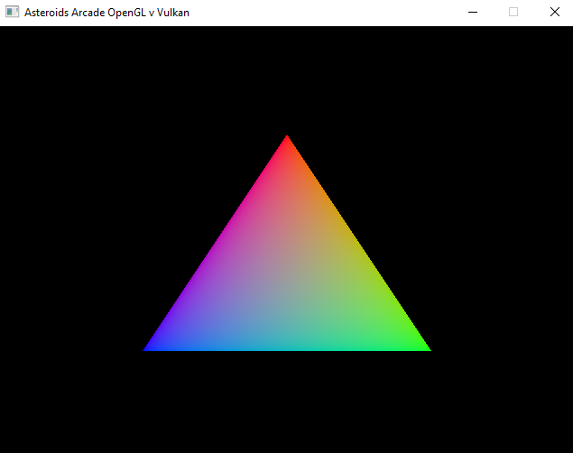
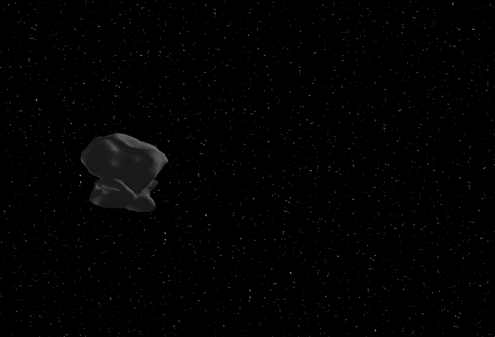

# Asteroids Arcade Game: OpenGL vs Vulkan
Code source of my Bachelor's Thesis for UBB 2023, a comparison between Vulkan 1.3 and OpenGL 4.7 Graphics APIs in terms of performance and the development process. Implements a copy of the Arcade classic game, [Asteroids](https://www.echalk.co.uk/amusements/Games/asteroidsClassic/ateroids.html).

## Images  

*14 june 2023: Screenshot of the test program*

                 
*29 may 2023: Many asteroids!*

         
*22 may 2023: Vulkan asteroids catching up to OpenGL*

    
*17 may 2023: basic Vulkan pipeline demo*

   
*4 may 2023: starry sky and lonely rotating asteroid*

  
*17 april 2023: basic OpenGL pipeline*
